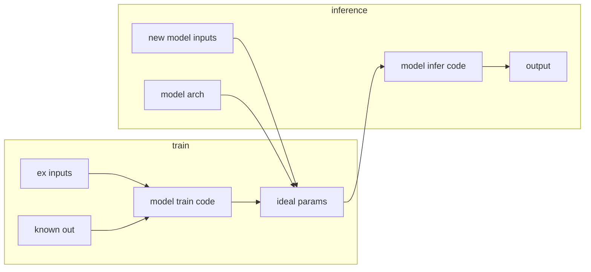
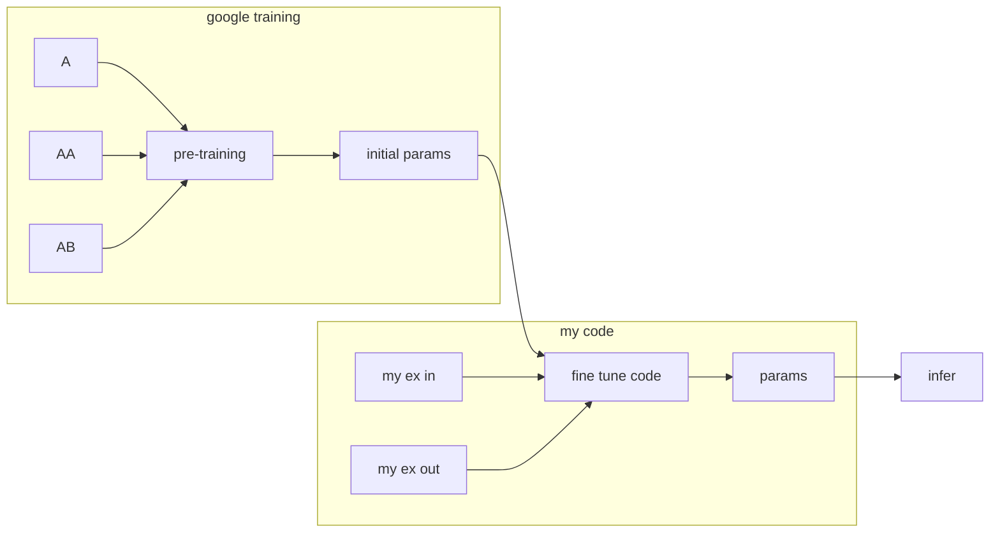
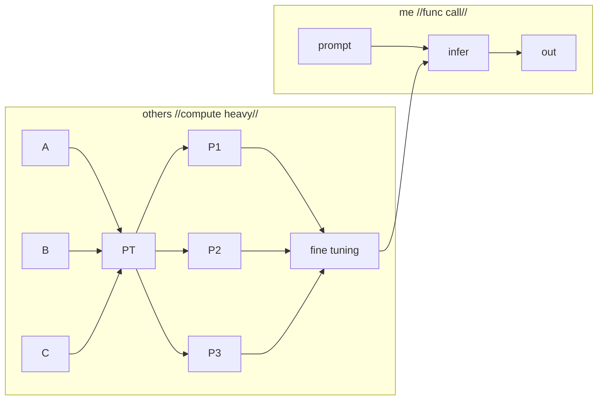
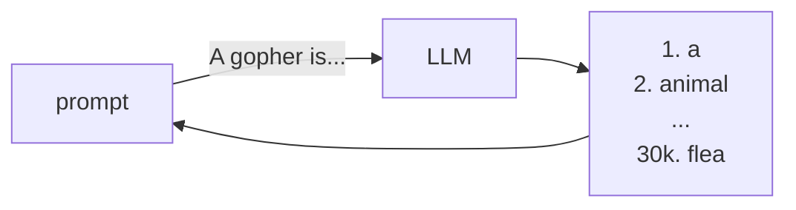
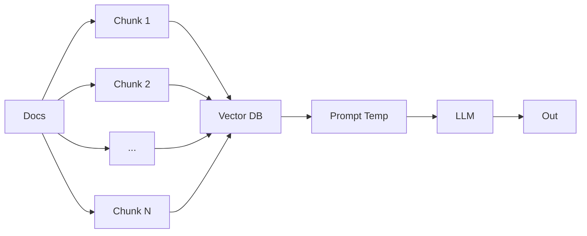

# Gophercon 24 notes

## Gen AI 1

https://hackmd.io/SoeISE6cQRGO8S3qZdXUvQ

https://github.com/dwhitena/go-genai-workshop
https://github.com/dwhitena/go-genai-workshop-build

### History

2012-2017:

Bert: 2017-2022

Fine-tuning / transfer learning

The major change is the pre-training and then appending task specific code to the end of the pipeline. The task specific code is often called `embedding` or `feature representation`.

Training on meta tasks was intended to help with further model enhancements however as they trained on the autocomplete models on the vast data of the internet they discovered the emergent behavior of gen ai.

> [!NOTE]
> emergent just means unexpected in this context

2022+: Gen AI

LLM generates a list of next tokens with a probability and then passes it as the new prompt. One of the tokens might be the end of sentence token.

Temperature was added to shuffle the ranked words to give some variance on the output.

### Misc

OpenAI initiated the process of using SSEs (server sent events) with responses vs websockets. Returning SSE vs the finished response gives a better UX to users. Using websockets would work, but it would be moving against the trend.

System prompts `client.Roles.System` are used to give context to the LLM,

Context is injected with every prompt. There are ways to reduce this burden, but its not consistent. Remember the greatest burden is the generation.

When the long context window its hard to determine how to determine which aspect of the context caused the issue. If there is a large context window you can use an LLM to summarize and reduce the window size.

### Retrieval Augmented Generation

DB Vector is a closeness via cosign-sim, l2 distance, etc

Multi-lingual models would theoretically share a similar vector space.

Advanced RAG

- hierarchical search finding most relevant chunk and related context
- elastic search then vector

If the context is 3 pages a summary may not be sufficient and the enrichment should be fine-tuned to the problem.

Bridge-tower model supports embedding images and text

Perf in enterprise:

- how long will it take to vectorize the docs
- how log will it take to search the docs

LLM is judge: use the LLM to rate if we answered the users question.

