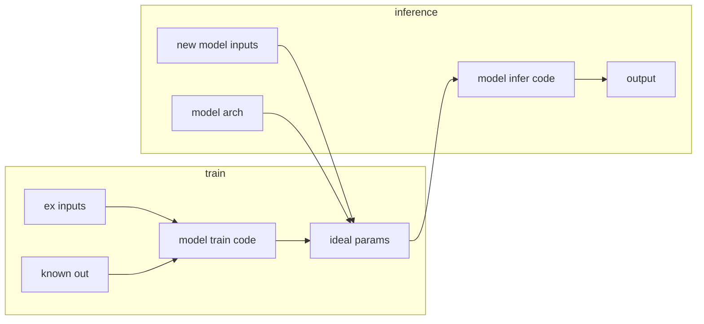
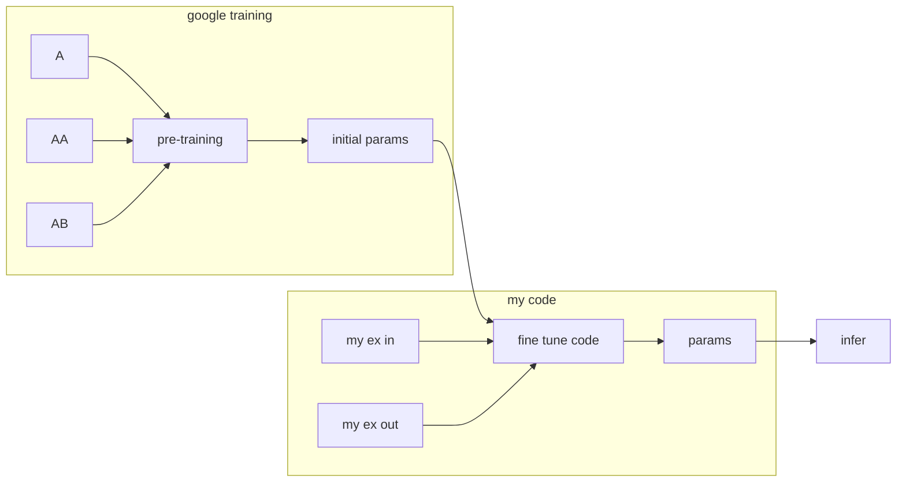

# Gophercon 24 notes

## Gen AI 1

https://hackmd.io/SoeISE6cQRGO8S3qZdXUvQ

https://github.com/dwhitena/go-genai-workshop
https://github.com/dwhitena/go-genai-workshop-build

### History

2012-2017:

Bert: 2017-2022

Fine-tuning / transfer learning

The major change is the pre-training and then appending task specific code to the end of the pipeline. The task specific code is often called `embedding` or `feature representation`.